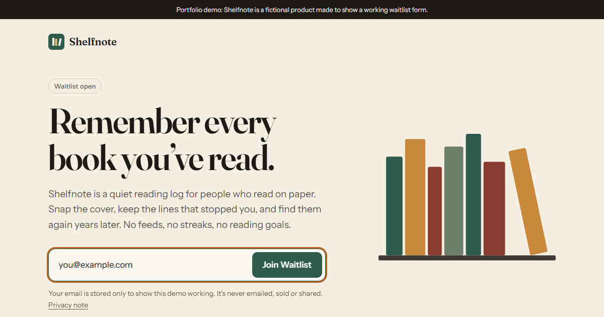
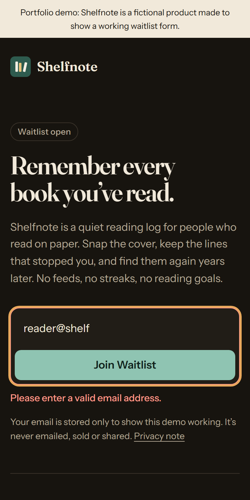

# Shelfnote waitlist

A single-page waitlist landing page with one email form that actually saves. Shelfnote is a fictional product; the page exists to show a production-ready signup flow end to end.

**Live demo:** https://waitlist-page-sepia.vercel.app





## What it does

- One email field and a **Join Waitlist** button. While saving, the button disables and reads "Saving...", so it can't create duplicate entries.
- Inline, field-level validation (empty and format checks), plus distinct messages for offline, slow network, rate limiting and server errors.
- On success, the form is replaced with a confirmation message that receives focus for screen-reader users.
- Submissions go to a Vercel serverless function, which validates the body and calls a Postgres function in Supabase.

## Stack

- **Vite + Preact** (via `preact/compat`, so components are written as plain React with `useState`). Chosen to meet the under-50 KB gzipped budget; React 19 alone is about 60 KB.
- **Vanilla CSS** with custom properties for theming, plus light and dark modes.
- **Vercel** for hosting and the `/api/waitlist` function.
- **Supabase (PostgreSQL)** for storage.

Production build: about 13 KB gzipped for the whole `dist/` folder (`npm run build && npm run size`).

## How submissions are protected

- The browser never talks to the database. `api/waitlist.js` accepts only `{ "email": string }` and re-validates it on the server.
- The `waitlist` table has row-level security enabled, no policies and no grants for public roles, so it can't be read or written through Supabase's public API.
- Inserts go through `join_waitlist()`, which only runs when called with a server-side token whose SHA-256 hash is stored in a non-exposed `private` schema.
- Rate limiting: 5 attempts per 10 minutes per client, keyed by a salted hash of the IP (raw IPs aren't stored, and hashes are purged after 24 hours).
- Duplicate emails are silently accepted, so the endpoint can't be used to check who has signed up.
- Security headers (CSP, `frame-ancestors 'none'`, `nosniff`, Referrer-Policy) are set in `vercel.json`.

## Running locally

```bash
npm install
npm run dev
```

Without Supabase env vars, the dev server mocks `/api/waitlist`, so every UI state can be tried. Emails starting with `slow` take 6 s, `fail` returns 500, `limit` returns 429 and `bad` returns 400; anything else succeeds.

To use a real database:

1. Create a Supabase project and run [`supabase/migrations/0001_waitlist.sql`](supabase/migrations/0001_waitlist.sql).
2. Generate a long random token, then store its hash:
   `insert into private.settings (key, value) values ('rpc_token_sha256', encode(sha256('<token>'::bytea), 'hex'));`
3. Copy `.env.example` to `.env.local` and fill in the values. The same variables go into your Vercel project settings.

| Variable | Purpose |
| --- | --- |
| `SUPABASE_URL` | Your project URL |
| `SUPABASE_PUBLISHABLE_KEY` | Publishable key (only used server-side) |
| `WAITLIST_RPC_TOKEN` | Secret that authorizes calls to `join_waitlist()` |
| `IP_HASH_SALT` | Salt for hashing client IPs for rate limiting |

## Project structure

```
api/waitlist.js            Serverless function: validation, IP hashing, RPC call
src/components/WaitlistForm.jsx
src/App.jsx / App.css      Page layout and the whole visual system
src/api.js                 Client submit function with timeout and error mapping
public/                    Favicon, privacy note, 404, robots.txt, sitemap.xml
supabase/migrations/       Database schema and RPC
```

## License

[MIT](LICENSE)
